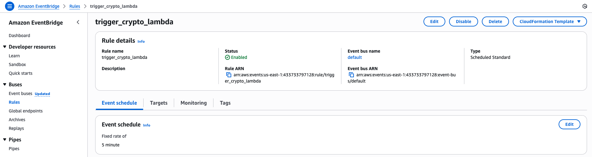

# ETL Pipeline on AWS

This project demonstrates an end-to-end **ETL (Extract, Transform, Load) pipeline** built with AWS services.  
The goal was to extract cryptocurrency data, transform it into a structured format, and make it queryable for analysis with Amazon Athena.

---

## Project Overview

- **Extract**: Collected cryptocurrency prices (Bitcoin, Ethereum, Cardano) from APIs and stored raw data in Amazon S3.
- **Transform**: Used AWS Glue jobs to convert raw JSON into optimized Parquet format.
- **Load & Query**: Crawled data with Glue Crawler, registered metadata in the Glue Data Catalog, and queried with Athena.
- **Visualization**: (Optional) Could be extended with Amazon QuickSight for dashboards.

---

## AWS Services Used

- **Amazon S3** → Raw and transformed data storage  
- **AWS Lambda** → Data ingestion (fetching crypto data)  
- **AWS Glue Crawler** → Automatically cataloged S3 data into the Glue Data Catalog  
- **AWS Glue Job** → Performed ETL and data transformation to Parquet  
- **AWS Glue Data Catalog** → Centralized metadata for querying  
- **Amazon Athena** → Serverless SQL queries over transformed data  

---

## Project Architecture

Here’s the high-level architecture of the ETL pipeline:

---

## Screenshots

### 1. Lambda Function – Data Ingestion
Fetches cryptocurrency data from APIs and writes raw JSON to S3.  

### 2. Raw Data in S3
Raw JSON files stored in S3 (`s3://bucket/raw/`).  

### 3. Glue Crawler
Scans the raw bucket and creates metadata tables in Glue Data Catalog.  

### 4. Glue Job – Data Transformation
Converts raw JSON into optimized Parquet format.  

### 5. Transformed Data in S3
The transformed Parquet data stored in a separate S3 folder.  

### 6. Athena Queries
Querying transformed data with Athena to analyze cryptocurrency prices.  

